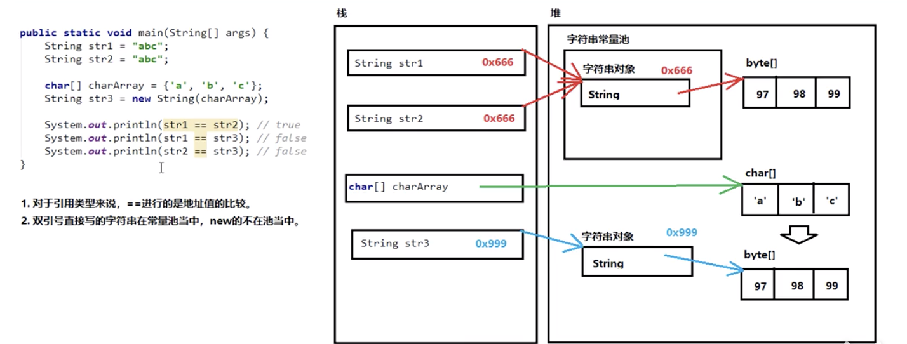
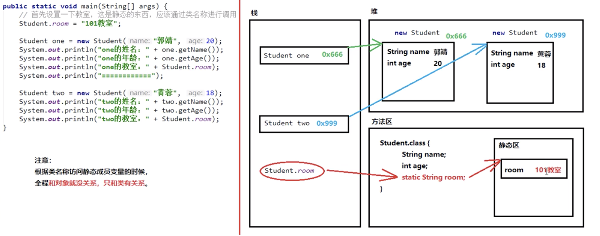

# String类
## 1.1 String类概述
### 概述
`java.lang.String`类代表字符串。Java程序中所有的字符串文字（例如`"abc"`）都可以被看作是实现此类的实例。
类`String`中包括用于检查各个字符串的方法，比如用于比较字符串，搜索字符串，提取子字符串以及创建具有翻译为大写或小写的所有字符的字符串的副本。

### 特点
1. 字符串不变：字符串的值在创建后不能被更改。
2. 因为`String`对象是不可变的，所以它们可以被共享。
3. `"abc"` 等效于 `char[] data={ 'a' , 'b' , 'c' }` 。

## 1.2 使用步骤
### 类
java.lang.String ：此类不需要导入。
### 构造方法
1. `public String()` ：初始化新创建的 `String`对象，以使其表示空字符序列。
2. `public String(char[] value)` ：通过当前参数中的字符数组来构造新的`String`。
3. `public String(byte[] bytes)` ：通过使用平台的默认字符集解码当前参数中的字节数组来构造新的`String`。

### 1.3 字符串常量池
双引号创建的字符串的地址在常量池中，指向堆中的`byte[]`数组

### 1.4 常用方法
#### 判断功能的方法
+ `public boolean equals (Object anObject)`：将此字符串与指定对象进行比较。
+ `public boolean equalsIgnoreCase (String anotherString)`：将此字符串与指定对象进行比较，忽略大小
写。

#### 获取功能的方法
+ `public int length ()` ：返回此字符串的长度。
+ `public String concat (String str)` ：将指定的字符串连接到该字符串的末尾。
+ `public char charAt (int index)` ：返回指定索引处的 char值。
+ `public int indexOf (String str)` ：返回指定子字符串第一次出现在该字符串内的索引。
+ `public String substring (int beginIndex)` ：返回一个子字符串，从`beginIndex`开始截取字符串到字符串结尾。
+ `public String substring (int beginIndex, int endIndex)` ：返回一个子字符串，从`beginIndex`到`endIndex`截取字符串。含`beginIndex`，不含`endIndex`。

#### 转换功能的方法
+ `public char[] toCharArray ()` ：将此字符串转换为新的字符数组。
+ `public byte[] getBytes ()` ：使用平台的默认字符集将该 String编码转换为新的字节数组。
+ `public String replace (CharSequence target, CharSequence replacement)` ：将与target匹配的字符串使用replacement字符串替换。

#### 分割功能的方法
+ `public String[] split(String regex)`：将此字符串按照给定的regex（规则）拆分为字符串数组。

# static关键字
## 2.1 概述
关于 static 关键字的使用，它可以用来修饰的成员变量和成员方法，被修饰的成员是属于类的，而不是单单是属于某个对象的。也就是说，既然属于类，就可以不靠创建对象来调用了。
## 2.2 定义和使用格式
### 类变量
当 static 修饰成员变量时，该变量称为类变量。该类的每个对象都共享同一个类变量的值。任何对象都可以更改该类变量的值，但也可以在不创建该类的对象的情况下对类变量进行操作。
+ 类变量：使用 static关键字修饰的成员变量

### 静态方法
当static 修饰成员方法时，该方法称为类方法 。静态方法在声明中有static ，建议使用类名来调用，而不需要创建类的对象。调用方式非常简单。
+ 类方法：使用 static关键字修饰的成员方法，习惯称为静态方法。
### 注意事项
静态方法调用的注意事项：
+ 静态方法可以直接访问类变量和静态方法。
+ 静态方法不能直接访问普通成员变量或成员方法。反之，成员方法可以直接访问类变量或静态方法。
+ 静态方法中，不能使用this关键字。
+ 静态方法只能访问静态成员。

## 2.3 静态原理图解

## 2.4 静态代码块
静态代码块：定义在成员位置，使用static修饰的代码块{ }。
+ 位置：类中方法外。
+ 执行：随着类的加载而执行且执行一次，优先于main方法和构造方法的执行。

## 2.5 Arrays类
`java.util.Arrays` 此类包含用来操作数组的各种方法，比如排序和搜索等。其所有方法均为静态方法，调用起来非常简单。

## 2.6 Math类
`java.lang.Math` 类包含用于执行基本数学运算的方法，如初等指数、对数、平方根和三角函数。类似这样的工具
类，其所有方法均为静态方法，并且不会创建对象，调用起来非常简单。

# 对象数组
数组的缺点： 长度定义后，长度不可以改变
ArrayList： 长度可以改变
## ArrayList
使用方法：后面跟`<E>`泛型，指定数组存贮的数据类型，泛型只能是引用类型，不能是基本类型，**基本类型没有地址**。可使用基本类型的包装类。

注意事项：如果直接打印ArrayList的实力对象，打印结果不是地址值，而是数据值。（内部改写了`toString`方法）