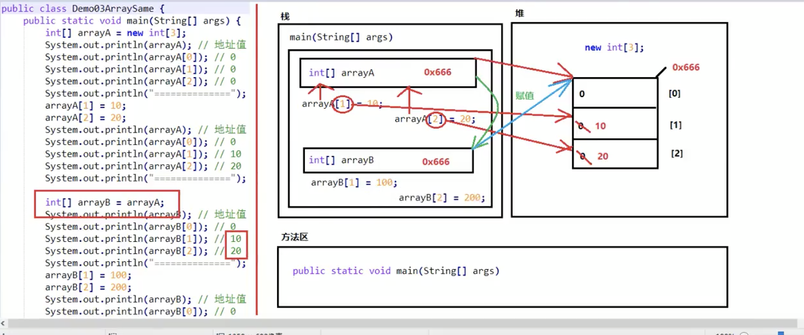

1. java虚拟机--jvm 跨平台开发
2. JRE(Java Runtime Environment)：java程序运行时环境，包含jvm和核心类库

常量的分类：
1. 字符串常量 "adf"
2. 整形常量
3. 浮点数常量
4. 字符常量 'a'
5. 布尔常量  `true false`
6. 空常量 `null`

基本数据类型：
引用数据类型：

隐式类型转换
根据数据展示范围由小到大转换

强制类型转换
```java
int a = (int)100L
```

## 方法的重载
相关因素：
1. 参数个数
2. 参数类型
3. 多类型参数顺序不同

无关因素：
1. 参数名称
2. 方法返回值类型

```java
/** 
  它的源代码就是用方法重载写的
  根据不同的输入参数，打印不同的值
 */
System.out.println()
```

## 数组
常见数组初始化方式：
1. 动态初始化（指定长度）
2. 静态初始化（指定内容）

注意事项
1. 静态初始化没有直接指定长度，但仍然会自动推算得到长度
2. 静态初始化标准格式可以拆分为两个步骤 
3. 动态初始化标准格式也可以拆分为两个步骤 
4. 静态初始化的省略格式，不能拆分成两个步骤

```java
// 动态初始化
int[] arr1 = new int[100];
// 静态初始化
int[] arr2 = new int[]{1, 2, 3};
// 静态初始化 省略格式
int[] arr2 = {1, 2, 3};
// 拆分为两个步骤
int[] arr3;
arr3 = new int[]{1, 2, 3};
System.out.println(arr1); // [I@74a14482
/**
[I@74a14482  内存地址的哈希值
[ 代表是数组类型
I 代表数组中项目类型是int
@后面的是内存地址
*/
```

## Java的内存分配
1. 栈（Stack）：存放的都是方法中的局部变量。**方法的运行一定要在栈当中**
   + 局部变量：方法的参数、方法内部的变量
   + 作用域：一旦超出作用域，立刻从栈内存中消失

2. 堆（Heap）：凡是new出来的东西，都在堆当中。
   1. 堆内存中的东西都有一个地址值：16进制
   2. 堆内存里面的数据，都有默认值

3. 方法区（Method Area）：存储.class相关信息，包含方法的信息。
   1. 
4. 本地方法栈（Native Method Stack）：与操作系统相关。
5. 寄存器（pc Register）：与CPU相关。

