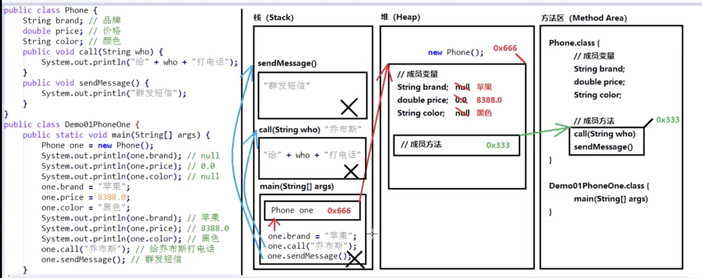
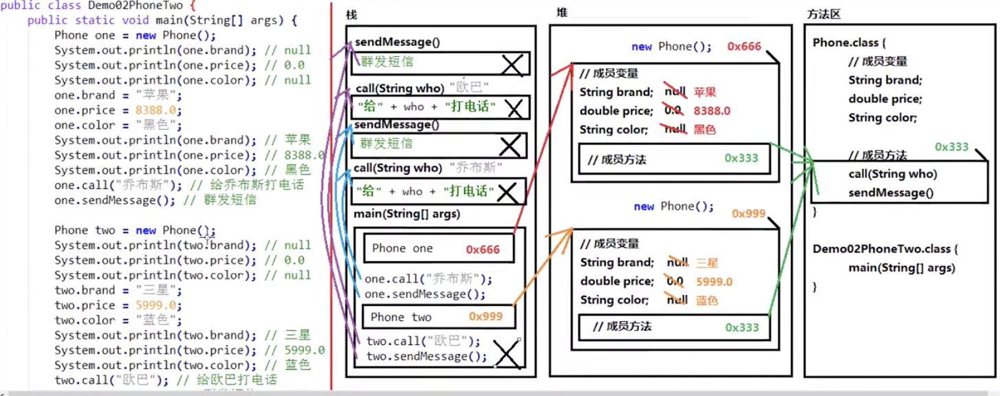

[TOC]
# 1 面向对象思想
## 1.1 面向对象思想概述
Java语言是一种面向对象的程序设计语言，而面向对象思想是一种程序设计思想，我们在面向对象思想的指引下，使用Java语言去设计、开发计算机程序。 这里的对象泛指现实中一切事物，每种事物都具备自己的属性和行为。面向对象思想就是在计算机程序设计过程中，参照现实中事物，将事物的属性特征、行为特征抽象出来，描述成计算机事件的设计思想。 它区别于面向过程思想，强调的是通过调用对象的行为来实现功能，而不是自己一步一步的去操作实现。
## 1.2 类和对象
什么是类
+ 类：是一组相关属性和行为的集合。可以看成是一类事物的模板，使用事物的属性特征和行为特征来描述该类事物。

现实中，描述一类事物：
+ 属性：就是该事物的状态信息。
+ 行为：就是该事物能够做什么。

### 什么是对象
对象：是一类事物的具体体现。对象是类的一个实例（对象并不是找个女朋友），必然具备该类事物的属性和行为。
### 类与对象的关系
类是对一类事物的描述，是抽象的。
对象是一类事物的实例，是具体的。
类是对象的模板，对象是类的实体。

## 1.3 类的定义
**成员变量：** 对应事物的**属性**
**成员方法：** 对应事物的**行为**

## 1.4 对象内存
类会在堆中开辟内存空间
空间中的变量会参考方法区.class中的成员变量来创建
空间中的方法存的是方法区的**地址**
对象内存图

两个对象内存图


## 1.5 成员变量和局部变量区别
1. 在类中的位置不同 重点
   + 成员变量：类中，方法外
   + 局部变量：方法中或者方法声明上(形式参数)
2. 作用范围不一样 重点
   + 成员变量：类中
   + 局部变量：方法中
3. 初始化值的不同 重点
   + 成员变量：有默认值
   + 局部变量：没有默认值。必须先定义，赋值，最后使用
4. 在内存中的位置不同 了解
   + 成员变量：堆内存
   + 局部变量：栈内存
5. 生命周期不同 了解
   + 成员变量：随着对象的创建而存在，随着对象的消失而消失
   + 局部变量：随着方法的调用而存在，随着方法的调用完毕而消失

# 2 面向对象的三大特征
## 2.1 封装性
### 概述
面向对象编程语言是对客观世界的模拟，客观世界里成员变量都是隐藏在对象内部的，外界无法直接操作和修改。封装可以被认为是一个保护屏障，防止该类的代码和数据被其他类随意访问。要访问该类的数据，必须通过指定的方式。适当的封装可以让代码更容易理解与维护，也加强了代码的安全性。
### 原则
将属性隐藏起来，若需要访问某个属性，提供公共方法对其访问。
## 2.2 封装的步骤
1. 使用 private 关键字来修饰成员变量。
2. 对需要访问的成员变量，提供对应的一对 getXxx 方法 、setXxx 方法。

## 2.3 封装的操作——private关键字
### private的含义
1. private是一个权限修饰符，代表最小权限。
2. 可以修饰成员变量和成员方法。
3. 被private修饰后的成员变量和成员方法，只在本类中才能访问。

## 2.4 this关键字
this代表所在类的当前对象的引用（地址值），即对象自己的引用。
> 记住 ：方法被哪个对象调用，方法中的this就代表那个对象。即谁在调用，this就代表谁。

## 2.5 构造方法
当一个对象被创建时候，构造方法用来初始化该对象，给对象的成员变量赋初始值。
> 小贴士：无论你与否自定义构造方法，所有的类都有构造方法，因为Java自动提供了一个无参数构造方法，一旦自己定义了构造方法，Java自动提供的默认无参数构造方法就会失效。

**注意事项**
   1. 如果你不提供构造方法，系统会给出无参数构造方法。
   2. 如果你提供了构造方法，系统将不再提供无参数构造方法。
   3. 构造方法的名称必须和所在的类名称完全一样。
   4. 构造方法不能带返回类型，也不能用return。
   5. 构造方法是可以**重载**的，既可以定义参数，也可以不定义参数。

## 标准代码——JavaBean
`JavaBean`是 Java语言编写类的一种标准规范。符合`JavaBean`的类，要求类必须是具体的和公共的，并且具有无参数的构造方法，提供用来操作成员变量的`set`和`get`方法。
```java
public class ClassName{
//成员变量
//构造方法
//无参构造方法【必须】
//有参构造方法【建议】
//成员方法
//getXxx()
//setXxx()
}
```