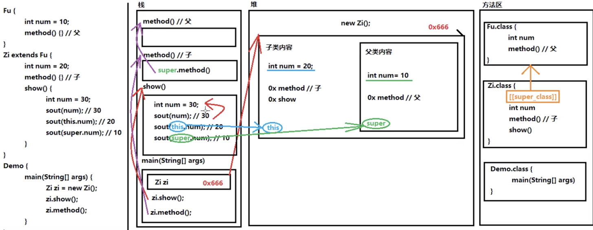

[TOC]
# 1 面向对象思想
## 1.1 面向对象思想概述
Java语言是一种面向对象的程序设计语言，而面向对象思想是一种程序设计思想，我们在面向对象思想的指引下，使用Java语言去设计、开发计算机程序。 这里的对象泛指现实中一切事物，每种事物都具备自己的属性和行为。面向对象思想就是在计算机程序设计过程中，参照现实中事物，将事物的属性特征、行为特征抽象出来，描述成计算机事件的设计思想。 它区别于面向过程思想，强调的是通过调用对象的行为来实现功能，而不是自己一步一步的去操作实现。
## 1.2 类和对象
什么是类
+ 类：是一组相关属性和行为的集合。可以看成是一类事物的模板，使用事物的属性特征和行为特征来描述该类事物。

现实中，描述一类事物：
+ 属性：就是该事物的状态信息。
+ 行为：就是该事物能够做什么。

### 什么是对象
对象：是一类事物的具体体现。对象是类的一个实例（对象并不是找个女朋友），必然具备该类事物的属性和行为。
### 类与对象的关系
类是对一类事物的描述，是抽象的。
对象是一类事物的实例，是具体的。
类是对象的模板，对象是类的实体。

## 1.3 类的定义
**成员变量：** 对应事物的**属性**
**成员方法：** 对应事物的**行为**

## 1.4 对象内存
类会在堆中开辟内存空间
空间中的变量会参考方法区.class中的成员变量来创建
空间中的方法存的是方法区的**地址**
对象内存图

两个对象内存图


## 1.5 成员变量和局部变量区别
1. 在类中的位置不同 重点
   + 成员变量：类中，方法外
   + 局部变量：方法中或者方法声明上(形式参数)
2. 作用范围不一样 重点
   + 成员变量：类中
   + 局部变量：方法中
3. 初始化值的不同 重点
   + 成员变量：有默认值
   + 局部变量：没有默认值。必须先定义，赋值，最后使用
4. 在内存中的位置不同 了解
   + 成员变量：堆内存
   + 局部变量：栈内存
5. 生命周期不同 了解
   + 成员变量：随着对象的创建而存在，随着对象的消失而消失
   + 局部变量：随着方法的调用而存在，随着方法的调用完毕而消失

# 2 封装性
## 2.1 
### 概述
面向对象编程语言是对客观世界的模拟，客观世界里成员变量都是隐藏在对象内部的，外界无法直接操作和修改。封装可以被认为是一个保护屏障，防止该类的代码和数据被其他类随意访问。要访问该类的数据，必须通过指定的方式。适当的封装可以让代码更容易理解与维护，也加强了代码的安全性。
### 原则
将属性隐藏起来，若需要访问某个属性，提供公共方法对其访问。
## 2.2 封装的步骤
1. 使用 private 关键字来修饰成员变量。
2. 对需要访问的成员变量，提供对应的一对 getXxx 方法 、setXxx 方法。

## 2.3 封装的操作——private关键字
### private的含义
1. private是一个权限修饰符，代表最小权限。
2. 可以修饰成员变量和成员方法。
3. 被private修饰后的成员变量和成员方法，只在本类中才能访问。

## 2.4 this关键字
this代表所在类的当前对象的引用（地址值），即对象自己的引用。
> 记住 ：方法被哪个对象调用，方法中的this就代表那个对象。即谁在调用，this就代表谁。

## 2.5 构造方法
当一个对象被创建时候，构造方法用来初始化该对象，给对象的成员变量赋初始值。
> 小贴士：无论你与否自定义构造方法，所有的类都有构造方法，因为Java自动提供了一个无参数构造方法，一旦自己定义了构造方法，Java自动提供的默认无参数构造方法就会失效。

**注意事项**
   1. 如果你不提供构造方法，系统会给出无参数构造方法。
   2. 如果你提供了构造方法，系统将不再提供无参数构造方法。
   3. 构造方法的名称必须和所在的类名称完全一样。
   4. 构造方法不能带返回类型，也不能用return。
   5. 构造方法是可以**重载**的，既可以定义参数，也可以不定义参数。

## 标准代码——JavaBean
`JavaBean`是 Java语言编写类的一种标准规范。符合`JavaBean`的类，要求类必须是具体的和公共的，并且具有无参数的构造方法，提供用来操作成员变量的`set`和`get`方法。
```java
public class ClassName{
//成员变量
//构造方法
//无参构造方法【必须】
//有参构造方法【建议】
//成员方法
//getXxx()
//setXxx()
}
```

# 3 继承性
## 1.1 概述
### 定义
继承：就是子类继承父类的属性和行为，使得子类对象具有与父类相同的属性、相同的行为。子类可以直接访问父类中的非私有的属性和行为。
### 好处
1. 提高代码的复用性。
2. 类与类之间产生了关系，是多态的前提。

## 1.2 继承的格式
通过 extends 关键字，可以声明一个子类继承另外一个父类，定义格式如下：
```java
class 父类 {
...
}
class 子类 extends 父类 {
...
}
```
## 1.3 成员方法重名——重写(Override)
### 概念
如果子类父类中出现重名的成员方法，这时的访问是一种特殊情况，叫做方法重写 (Override)。
+ 方法重写 ：子类中出现与父类一模一样的方法时（返回值类型，方法名和参数列表都相同），会出现覆盖效果，也称为重写或者复写。声明不变，重新实现。
### 重写的应用
子类可以根据需要，定义特定于自己的行为。既沿袭了父类的功能名称，又根据子类的需要重新实现父类方法，从
而进行扩展增强。比如新的手机增加来电显示头像的功能，代码如下：

### 注意事项
1. 重写时，调用父类的成员方法，用super.父类成员方法。
2. 子类方法覆盖父类方法，子类方法**返回值范围**必须小于等于父类方法
3. 子类方法覆盖父类方法，必须要保证权限大于等于父类权限。
4. 子类方法覆盖父类方法，返回值类型、函数名和参数列表都要一模一样。

## 1.4 继承后的特点——构造方法
1. 构造方法的名字是与类名一致的。所以子类是无法继承父类构造方法的。
2. 构造方法的作用是初始化成员变量的。所以子类的初始化过程中，**必须先执行父类的初始化动作**。子类的构造方法中默认有一个super() ，表示调用父类的构造方法，父类成员变量初始化后，才可以给子类使用。

## 1.5 super和this
### 父类空间优先于子类对象产生
在每次创建子类对象时，先初始化父类空间，再创建其子类对象本身。目的在于子类对象中包含了其对应的父类空间，便可以包含其父类的成员，如果父类成员非private修饰，则子类可以随意使用父类成员。代码体现在子类的构造方法调用时，一定先调用父类的构造方法。理解图解如下：

### super和this的含义
+ super ：代表父类的存储空间标识(可以理解为父亲的引用)。
+ this ：代表当前对象的引用(谁调用就代表谁)。

> 子类的每个构造方法中均有默认的super()，调用父类的空参构造。手动调用父类构造会覆盖默认的super()。super() 和 this() 都必须是在构造方法的第一行，所以不能同时出现。

## 1.6 继承的特点
1. Java只支持单继承，不支持多继承。
2. Java支持多层继承(继承体系)。
   > *顶层父类是Object类。所有的类默认继承Object，作为父类。*
3. 子类和父类是一种相对的概念。

## 1.7 抽象类
### 概述
父类中的方法，被它的子类们重写，子类各自的实现都不尽相同。那么父类的方法声明和方法主体，只有声明还有意义，而方法主体则没有存在的意义了。我们把没有方法主体的方法称为抽象方法。Java语法规定，**包含抽象方法的类就是抽象类**。
### 定义
抽象方法 ：没有方法体的方法。
抽象类：包含抽象方法的类。
### abstract使用格式
#### 抽象方法
使用abstract 关键字修饰方法，该方法就成了抽象方法，抽象方法只包含一个方法名，而没有方法体。
定义格式：
```java
修饰符 abstract 返回值类型 方法名 (参数列表)；
```
#### 抽象类
如果一个类包含抽象方法，那么该类必须是抽象类。
定义格式：
```java
public abstract class Animal {
   public abstract void run()；
}
```
#### 抽象的使用
继承抽象类的**子类必须重写父类所有的抽象方法**。否则，该子类也必须声明为抽象类。最终，**必须有子类实现该父类的抽象方法**，否则，从最初的父类到最终的子类都不能创建对象，失去意义。
此时的方法重写，是子类对父类抽象方法的完成实现，我们将这种方法重写的操作，也叫做实现方法。

#### 注意事项
关于抽象类的使用，以下为语法上要注意的细节，虽然条目较多，但若理解了抽象的本质，无需死记硬背。
1. 抽象类不能创建对象，如果创建，编译无法通过而报错。只能创建其非抽象子类的对象。
> 理解：假设创建了抽象类的对象，调用抽象的方法，而抽象方法没有具体的方法体，没有意义。
2. 抽象类中，可以有构造方法，是供子类创建对象时，初始化父类成员使用的。
> 理解：子类的构造方法中，有默认的super()，需要访问父类构造方法。
3. 抽象类中，不一定包含抽象方法，但是有抽象方法的类必定是抽象类。
> 理解：未包含抽象方法的抽象类，目的就是不想让调用者创建该类对象，通常用于某些特殊的类结构设计。
4. 抽象类的子类，必须重写抽象父类中所有的抽象方法，否则，编译无法通过而报错。除非该子类也是抽象类。
> 理解：假设不重写所有抽象方法，则类中可能包含抽象方法。那么创建对象后，调用抽象的方法，没有意义。

## 1.8 接口
### 1.1 概述
接口，是Java语言中一种引用类型，是方法的集合，如果说类的内部封装了成员变量、构造方法和成员方法，那么接口的内部主要就是封装了方法，包含抽象方法（JDK 7及以前），默认方法和静态方法（JDK 8），私有方法（JDK 9）。
### 1.2 定义格式
1. 抽象方法：使用abstract 关键字修饰，可以省略，没有方法体。该方法供子类实现使用。
2. 默认方法：使用 default 修饰，不可省略，供子类调用或者子类重写。
3. 静态方法：使用 static 修饰，供接口直接调用。
4. 私有方法：使用 private 修饰，供接口中的默认方法或者静态方法调用。
```java
public interface InterFaceName {
   public abstract void method(); // 抽象方法
   public default void method() {
      // 静态方法
   }
   public static void method2() {
      // 执行语句
   }
   private void method() {
      // 私有方法
   }
}
```

# 4 多态性
## 1 概述
### 定义
多态：是指同一行为，具有多个不同表现形式。
### 前提【重点】
1. 继承或者实现【二选一】
2. 方法的重写【意义体现：不重写，无意义】
3. 父类引用指向子类对象【格式体现】

## 2 多态的体现
多态体现的格式：
```java
父类类型 变量名 = new 子类对象；
变量名.方法名();
```
> 父类类型：指子类对象继承的父类类型，或者实现的父接口类型。

代码如下：
```java
Fu f = new Zi();
f.method();
```
**当使用多态方式调用方法时，首先检查父类中是否有该方法，如果没有，则编译错误；如果有，执行的是子类重写后方法。**
## 3 多态的好处
实际开发的过程中，父类类型作为方法形式参数，传递子类对象给方法，进行方法的调用，更能体现出多态的扩展性与便利
## 4 引用类型转换
#### 向上转型
+ 向上转型：多态本身是子类类型向父类类型向上转换的过程，这个过程是默认的。
当父类引用指向一个子类对象时，便是向上转型。
```java
Animal a = new Cat();
```
#### 向下转型
+ 向下转型：父类类型向子类类型向下转换的过程，这个过程是强制的。
一个已经向上转型的子类对象，将父类引用转为子类引用，可以使用强制类型转换的格式，便是向下转型。
```java
Cat c =(Cat) a;
```
#### 为什么要转型
当使用多态方式调用方法时，首先检查父类中是否有该方法，如果没有，则编译错误。也就是说，不能调用子类拥有，而父类没有的方法。编译都错误，更别说运行了。这也是多态给我们带来的一点"小麻烦"。所以，想要调用子类特有的方法，必须做向下转型。
#### 转型的异常
向下转型是个还原的过程，如果还原的目标对象与原对象不一致，就会发生异常`ClassCastException`，类型转换异常。
为了避免ClassCastException的发生，Java提供了 instanceof 关键字，给引用变量做类型的校验，格式如下：
```java
变量名 instanceof 数据类型
如果变量属于该数据类型，返回true。
如果变量不属于该数据类型，返回false。
```

# 5 final关键字
final： 不可改变。可以用于修饰类、方法和变量。
+ 类：被修饰的类，不能被继承。
+ 方法：被修饰的方法，不能被重写。
+ 变量：被修饰的变量，不能被重新赋值。

# 6 权限修饰符
+ public：公共的
+ protected：受保护的
+ default：默认的
+ private：私有的

## 不同权限的访问能力
| |public|protected|default(空)|private|
|:---|:---:|:---:|:---:|:---:|
|同一类中|√|√|√|√|
|同一包中(子类与无关类)|√|√|√|×|
|不同包的子类|√|√|×|×|
|不同包中的无关类|√|×|×|×|

可见，public具有最大权限。private则是最小权限。
编写代码时，如果没有特殊的考虑，建议这样使用权限：
+ 成员变量使用private ，隐藏细节。
+ 构造方法使用public ，方便创建对象。
+ 成员方法使用public ，方便调用方法。
> 小贴士：不加权限修饰符，其访问能力与default修饰符相同

# 7 内部类
## 什么是内部类
将一个类A定义在另一个类B里面，里面的那个类A就称为内部类，B则称为外部类。
## 成员内部类
成员内部类 ：定义在类中方法外的类。
### 访问特点
+ 内部类可以直接访问外部类的成员，包括私有成员。
+ 外部类要访问内部类的成员，必须要建立内部类的对象。
创建内部类对象格式：
```java
外部类名.内部类名 对象名 = new 外部类型().new 内部类型()；
```
> 内部类仍然是一个独立的类，在编译之后会内部类会被编译成独立的.class文件，但是前面冠以外部类的类名和\$符号 。比如，Person$Heart.class

## 匿名内部类【重点】
匿名内部类 ：是内部类的简化写法。它的本质是一个带具体实现的 父类或者父接口的 匿名的 子类对象。开发中，最常用到的内部类就是匿名内部类了。

## 引用类型用法总结
1. class作为成员变量
2. interface作为成员变量
3. interface作为方法参数和返回值类型