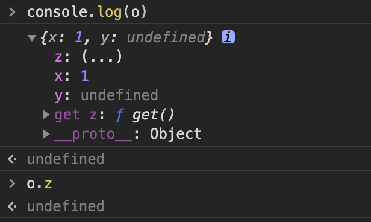
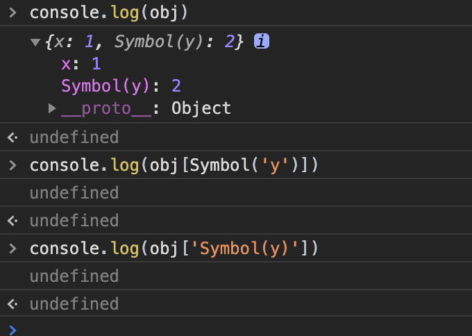

# 打印对象o的某个属性为undifined， console.log(o)之后展开能却能看到该属性？
这个问题的大概意思是：
```javascript
console.log(o) // {x:1,y:2}
console.log(o.y) // undefined
```

看到这道题我第一反应就是重写对象属性的getter：
```javascript
let o = { x:1, y:undefined }
Object.defineProperty(o, 'z', {
  configurable: true,
  enumerable: true,
  get() {
    return undefined
  }
})
```
打印的结果：


不过当我回答完之后，面试官说还有其他方法吗？我当时并没有回答上，知道后来无意中看到一个视频，终于知道另一种实现这个中情况的方法——`Symbol`
利用Symbol生成唯一的值作为键
```javascript
let obj = {x: 1}
let symboly = Symbol('y')
obj[symboly] = 2
```
打印的结果：
